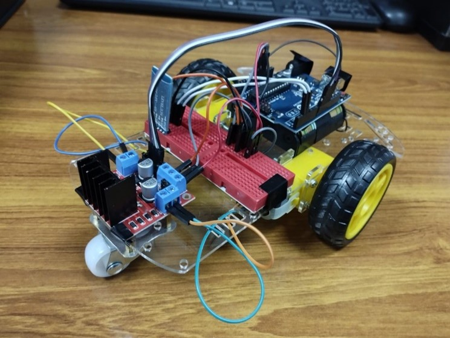

# BlueDuino-Project
Abstract—The primary aim was to establish a wireless communication channel between a mobile device and the car for remote control operations. This report delineates the hardware setup, software design, and overall performance evaluation of the system.

The hardware integration involved assembling the Arduino Uno, L298N motor driver, and HC-05 Bluetooth module onto the 2WD chassis car kit, encompassing meticulous circuitry and wiring configurations. On the software front, a user-friendly mobile application was developed via MIT App Inventor to facilitate seamless Bluetooth connectivity and intuitive control mechanisms.  

Keywords— Arduino Uno, L298N, HC-05, MIT App Inventor, Bluetooth, 2WD Chassis Car.



## I.	INTRODUCTION 

The landscape of robotics and automation has witnessed an upsurge in the utilization of remote-controlled mechanisms, advancing the world of convenience, efficiency, and innovation. Within this context, this project delves into the development and implementation of a Bluetooth-controlled 2WD chassis car, leveraging modern technologies such as the Arduino Uno microcontroller, L298N motor driver, HC-05 Bluetooth module, and MIT App Inventor.

The adoption of Arduino Uno, a widely accessible and versatile microcontroller, served as the project's core processing unit. Coupled with the L298N motor driver for motor control and the HC-05 Bluetooth module for wireless communication, the system aimed to achieve precise maneuverability and responsiveness through a mobile application built using MIT App Inventor. Bluetooth technology, being pervasive and efficient in short-range wireless communication, provided an ideal conduit for seamless interaction between the mobile app and the car.

## II.	MATERIALS AND METHODS

### A.	Hardware Components
- Arduino Uno
- L298N
- HC-05
- 2WD Chassis
- AA Batteries

•	Arduino Uno Microcontroller— The Arduino Uno serves as the central processing unit, interfacing with the L298N motor driver and HC-05 Bluetooth module. It interprets incoming Bluetooth commands and controls the motors' speed and direction based on these commands. 

•	L298N Motor Driver— The L298N motor driver is responsible for controlling the two DC motors of the 2WD car. It receives signals from the Arduino Uno and regulates the voltage and direction supplied to the motors, enabling precise movement control.

•	HC-05 Bluetooth Module—The HC-05 Bluetooth module establishes a wireless communication link between the Arduino Uno and external devices such as smartphones. It operates in slave mode, receiving and transmitting serial data to enable remote control functionalities. 

•	2WD Chassis Car Kit—The physical platform of the car consists of a 2WD chassis kit, including two DC motors, wheels, and a structure providing the necessary support for the hardware components. 

### B.	Software Tools

-	MIT App Inventor—MIT App Inventor, a visual development platform, is employed to design and create the mobile application interface. The application allows users to establish a Bluetooth connection with the car and send directional commands for controlling its movement. 

-	Arduino IDE—The Arduino Integrated Development Environment (IDE) is utilized for programming the Arduino Uno microcontroller. Custom code is developed to manage Bluetooth communication, interpret incoming commands, and control the motors' behavior based on received instructions. 

### C.	System Architecture

#### 1.	Bluetooth Communication Layer:

-	The HC-05 Bluetooth module facilitates wireless communication between the Arduino Uno and the mobile application. It establishes a serial communication link using the Serial Peripheral Interface (SPI) protocol.

-	The Arduino Uno is programmed to listen for incoming Bluetooth commands and interpret these instructions to determine the desired movement (forward, backward, left, right).

#### 2.	Motor Control Layer:

-	The Arduino Uno interfaces with the L298N motor driver to control the speed and direction of the DC motors.

-	PWM (Pulse Width Modulation) signals are generated by the Arduino to adjust the motor speeds, while H-bridge configurations on the L298N module control the motor direction.

#### 3.	User Interface Layer:

-	The mobile application, designed using MIT App Inventor, offers a user-friendly interface for sending control commands to the car.

-	The application establishes a Bluetooth connection with the HC-05 module on the Arduino and transmits directional inputs based on user interactions with the graphical interface.

#### 4.	Integration:

-	The integration of these layers allows for seamless interaction between the user interface, Bluetooth communication, and motor control components, enabling remote operation of the 2WD car. 

## III.	IMPLEMENTATION

### A.	Assembly and Wiring

- Motor connections: Two DC motors were connected to the output terminals of the L298N motor driver, ensuring correct polarity for forward and reverse movements.

- Power connections: The power supply was distributed appropriately to power the Arduino Uno, motor driver, and other electronic components involved.

- HC-05 Bluetooth module: The module was connected to the Arduino Uno via serial communication pins (TX, RX) and power connections (VCC, GND).

### B.	Mobile App Creation using MIT App Inventor

- User Interface Design: Using MIT App Inventor's visual interface, the mobile application was designed to provide an intuitive user interface. Graphical elements like buttons were incorporated to represent directional controls (forward, backward, left, right, stop) for the car's movement. User feedback elements such as labels or messages were included to display connection status.

- Bluetooth Communication Setup: MIT App Inventor offers Bluetooth connectivity components that were utilized to establish a connection between the mobile device and the HC-05 module. Pairing and connection processes were programmed within the app, allowing users to search for and connect to the Bluetooth module on the Arduino-based car.

- Command Transmission: Upon successful Bluetooth connection, the app was programmed to send specific commands corresponding to user inputs (button presses or slider adjustments). These commands were transmitted as serial data packets containing instructions for the desired movements (forward, backward, left, right) of the car. 

### C.	Source Code

Initialization:
```c++
#include <SoftwareSerial.h>
SoftwareSerial bluetooth(2, 3); // RX, TX pins for Bluetooth
```
Defining Motor Pins:
```c++
// Motor control pins
int motor1Pin1 = 8; // Motor 1 control pin 1
int motor1Pin2 = 9; // Motor 1 control pin 2
int motor2Pin1 = 10; // Motor 2 control pin 1
int motor2Pin2 = 11; // Motor 2 control pin 2
```
Defining Pin Modes and starting communication with HC-05:
```c++
void setup() {
  // Define motor control pins as outputs
  pinMode(motor1Pin1, OUTPUT);
  pinMode(motor1Pin2, OUTPUT);
  pinMode(motor2Pin1, OUTPUT);
  pinMode(motor2Pin2, OUTPUT);
  // Set up communication with Bluetooth module
  bluetooth.begin(9600);
} 
```
Continuous Section:
```c++
void loop() {
  // Check if there's data available from Bluetooth
  if (bluetooth.available() > 0) {
    char command = bluetooth.read(); // Read the incoming command
    // Perform actions based on the received command
    switch (command) {
      case 'F': // If command is 'F', move forward
        moveForward();
        break;
      case 'B': // If command is 'B', move backward
        moveBackward();
        break;
      case 'L': // If command is 'L', turn left
        turnLeft();
        break;
      case 'R': // If command is 'R', turn right
        turnRight();
        break;
      case 'S': // If command is 'S', stop motors
        stopMotors();
        break;
    }
  }
}
```
## IV.	RESULT AND DISCUSSION

Upon successful implementation, the Bluetooth-controlled 2WD car demonstrated responsive movement corresponding to the commands transmitted from the mobile application. The system exhibited stable Bluetooth connectivity and reliable control functionalities.

## V.	ACKNOWLEDGMENT

The successful completion of this project was made possible through the collaborative contributions of both the members of the Project group. We would also like to express our gratitude to:

Our Lab Instructor: Engr. Irfanullah, for their valuable guidance throughout the semester, providing insightful suggestions throughout our lab sessions.

## VI.	REFERENCES

[1]	Arduino Official Website. [https://www.arduino.cc]

[2]	MIT App Inventor. [https://ai2.appinventor.mit.edu]
 

